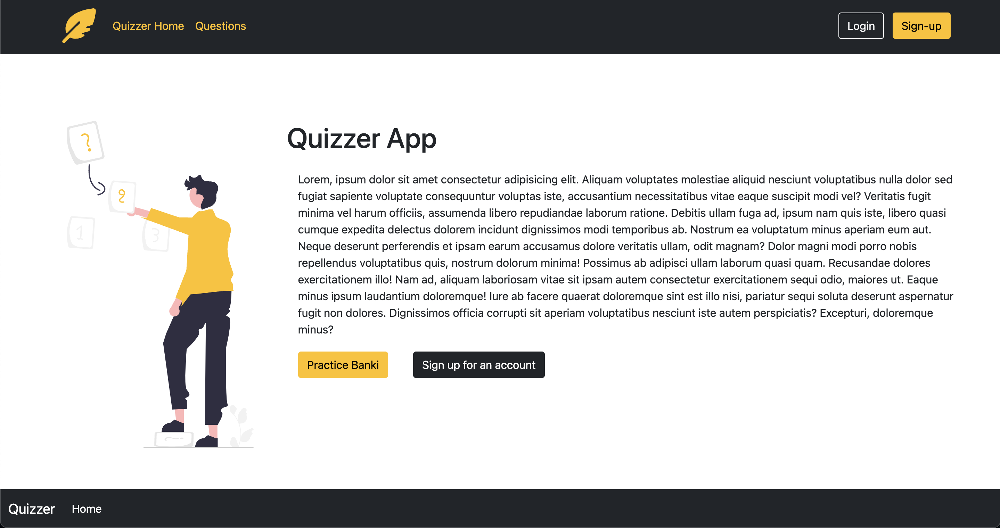

# Quizzer App 

A simple flash card generator with CRUD capabilities for Decks and Cards.

**Link to project:** 
[Link TBD]()

## How It's Made:

**Tech used:** bcrypt, connect-mongo, dotenv, ejs, express, express-flash, express-session, mongodb, mongoose, morgan, nodemon, passport, passport-local, validator

## Why It Was Made:
Studying is hard, but when you can turn studying into a friendly competition, well, now we're talking!

---
## Project Checklist for Team: 
- [x] Create an `.env` file and add the following as `key: value` pairs
    - PORT: 2121 (Or whatever you choose!)
    - DB_STRING: `your database URI`
- [ ] CSS Styling with Bootstrap 
- [ ] Generate `ejs` template in views 
- [ ] Follow CRUD operations for new routes and controllers (decks/cards/quizzes)
- [ ] Create new schemas in models for decks and cards 
- [ ] Deploy to Heroku/Netlify 

## Issues 
- Issues we run into will go here.

## Lessons Learned:
- Lessons learned form those issues will go here. 

## Optimizations
- Create an option for users to reset a forgotten password
- Temporary link generator that allows you to send quizzes to anyone

## Steps run project: 
- Install all dependences or node packages used for development via Terminal `npm install`

